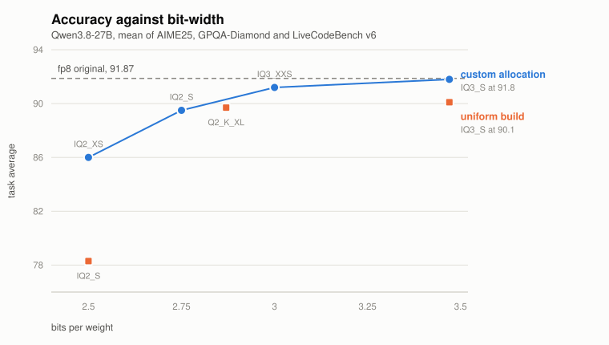

# llmash

[](https://github.com/omgitsbase/llmash/releases/latest)
[](https://github.com/omgitsbase/llmash/blob/main/LICENSE)
[](https://github.com/omgitsbase/llmash/releases/latest)
[](https://isocpp.org)
[](https://developer.nvidia.com/cuda-toolkit)
[](https://deepwiki.com/omgitsbase/llmash)

An Ollama-compatible server and command line for Windows, built on llama.cpp.
There is an alpha Linux build too.

It serves your GGUF files through `llama-server` and keeps Ollama's commands,
API and model store, so anything already pointed at Ollama keeps working. What
it changes is the llama.cpp settings, picked per model at launch.

```powershell
irm https://raw.githubusercontent.com/omgitsbase/llmash/main/install.ps1 | iex
```

Nothing needs to be installed first: the installer fetches the llama.cpp build
for your GPU, puts `llmash` on your PATH, and starts the server. With no
NVIDIA card it takes the Vulkan or CPU build instead, and models load into
system RAM, which works but is slower.

On Linux:

```sh
curl -fsSL https://raw.githubusercontent.com/omgitsbase/llmash/main/install.sh | sh
```

Same idea, under systemd, finding any models an existing Ollama has. `pull` is
not implemented there yet, so models have to already be on disk. llama.cpp
publishes no Linux CUDA build, so a GPU gets Vulkan and everything else gets
CPU; `--runtime` overrides that, `--user` keeps it in your home directory and
`--uninstall` removes it.

## Models you already have

Ollama's store is found and used as it is. A folder of GGUFs from llama.cpp
or LM Studio is one command away:

```powershell
llmash models set D:\models
```

It reads that folder in place, subfolders included. Nothing is copied or
deleted, and `rm` will not touch it. `llmash models` shows what is being read.
This is the same setting as `OLLAMA_MODELS`.

## Speed

Same prompts, same GPU (an RTX PRO 6000 Blackwell, 96 GB), each tool running the
model it gives you by default. Your numbers will differ.

The rows are different files on purpose. Ollama pulls a Q8_0. vLLM runs 8-bit
weights of the same size, with speculative decoding. llmash runs a 3-bit build it
puts together itself, with a drafter. Most of the gap is bytes read per token,
not engine, and the smaller file does not cost accuracy: at 3 bits the published
results for this method sit 0.7% under fp8.

The llmash and vLLM rows move between runs, by up to a third, because speculative
decoding is faster on predictable text. Ollama has no drafter and repeats to a
tenth of a token per second.

<!-- BENCHMARK -->

**gemma-4 26B-A4B**

| backend | build | conversation | coding | thinking |
|---|---|--:|--:|--:|
| Ollama | Q8_0, 28.1 GB | 198.6 | 199.1 | 197.5 |
| **llmash**\* | RCO-3, 8.9 GB | **333.2** | **449.5** | **445.5** |

**Qwen3.6 35B-A3B**

| backend | build | conversation | coding | thinking |
|---|---|--:|--:|--:|
| Ollama | Q8_0, 38.7 GB | 204.5 | 204.6 | 207.2 |
| vLLM | INT8 GPTQ, 43 GB | 302.2 | 353.4 | 457.0 |
| **llmash**\* | RCO-3, 12.5 GB | **455.0** | **534.3** | **569.3** |

**Qwen3.8 27B**

| backend | build | conversation | coding | thinking |
|---|---|--:|--:|--:|
| Ollama | Q8_0, 29.0 GB | 50.1 | 50.1 | 50.0 |
| vLLM | INT8 W8A16, 32 GB | 50.9 | 51.1 | 63.6 |
| **llmash**\* | RCO-3, 9.6 GB | **153.2** | **170.1** | **178.3** |

Tokens per second while generating, median of five runs, excluding model load and prompt processing. Ollama's rows are from one model load; between loads they drift by about a tenth.

\* llmash runs a custom build: one quantization type per tensor, chosen under a size budget and assembled on this machine. No other runtime has an equivalent. RCO-3 answers nearly identically to Q8_0: on the published benchmarks the 3-bit allocation scores within a point of the fp8 original, at a third of the bytes. Ollama runs its own Q8_0 pull, which ships without a draft model; vLLM runs 8-bit weights with speculative decoding; llmash runs what a pull assembles, drafter and launch settings included.

<!-- /BENCHMARK -->

vLLM is the native Windows build on 8-bit weights (INT8, weight-only, the same
bytes as a Q8_0), with the draft model published for Qwen3.6 and n-gram lookup
for Qwen3.8. Its fp8 path is not an option on this card: the wheel carries only
the Ampere w8a8 kernel and aborts in `cutlass_scaled_mm_sm80_epilogue` on
Blackwell, so INT8 through Marlin is what runs. gemma-4 has no vLLM row at all,
because `head_dim` varies per layer in that architecture and the loader refuses
it.

## How it fits together

- **`llmash.exe`** is the command line and the server. `llmashw.exe` is the same
  program with no console, for the tray.
- **The server** owns the model store, starts and stops `llama-server`
  processes, and decides how long each one stays resident.
- **The tray** unloads a model, sets the keep-alive, restarts the server, and
  starts it at login.
- **Routes** send a named model to another OpenAI-compatible server, and fall
  back to llama.cpp when that server is not running. Not yet in the C++ build.

Per model, at launch, it picks the ordinary llama.cpp settings and logs each:
prompt-prefix reuse, a host-RAM prompt cache sized from free RAM, batch width
when the card has room, raised process priority, and DirectIO loading.
`LLMASH_TUNE_OFF` disables any of them.

## Custom builds

`pull` lists a build assembled here beside the published ones. Every tensor is
measured at each candidate type and given the one that buys the most accuracy
per byte under a size budget, so the bits go where they change the answer. The
tag is the target width: `RCO-3` averages 3 bits a weight, and it is the one
offered.

```
qwen3-1.7b, which build?
  tiny     IQ3_XS                  923 MB
  rco 3    Q8 quality, Q4 size     2.2 GB bandwidth
  medium   Q4_K_M                  1.1 GB
  large    Q8_0                    2.2 GB
```

Pick it and you choose the width: 2.75, 3, 3.4, 3.9, 4.4 or 5 bits a weight,
each with what that width is worth against a Q8:

```
how small?
  rco 2.75 about 703 MB   2.6% under Q8
  rco 3    about 766 MB   near identical to Q8
  rco 3.4  about 869 MB   near identical to Q8
  rco 3.9  about 996 MB   matches Q8
```

It then shows the cost against the nearest published build and asks:

```
                                       download    on disk
  RCO-3         ████████████████████     2.2 GB    ~766 MB
  IQ3_XS        ████████                 923 MB     923 MB
```

Twice the download, and a minute or two of quantizing on the GPU. Against
llama.cpp's own build of the same size, on technical problems at temperature 0
with the Q8_0 as the reference:

| build | size | correct |
|---|---|---|
| Q8_0 | 2.02 GB | 5/6 |
| IQ3_XS | 0.90 GB | 4/6 |
| RCO-3.9 | 0.93 GB | 5/6 |

Six problems is a small sample. The published results below are the proper
measurement, and they are where the picker's quality figures come from: the
custom allocation stays within a point of the original down to 3 bits a weight,
where a uniform build of the same size has already fallen apart.

<picture>
  <source media="(prefers-color-scheme: dark)" srcset="assets/accuracy-dark.svg">
  
</picture>

| bits a weight | custom allocation | uniform build |
|---|--:|--:|
| 2.50 | 86.0 | 78.3 |
| 2.75 | 89.5 | - |
| 2.87 | - | 89.7 |
| 3.00 | 91.2 | - |
| 3.47 | 91.8 | 90.1 |

Published GSQ-RCO figures on Qwen3.8-27B, the mean of AIME25, GPQA-Diamond and
LiveCodeBench v6, against an fp8 original scoring 91.87. They measure the method,
not this implementation.

The source is the smallest published build that is still comfortably wider than
the target: a 3-bit build reads a Q6_K rather than a Q8_0, a quarter fewer bytes.
It is read a block at a time and dropped once quantized, so only the result
touches disk. Qwen3.6-35B-A3B goes from 32 GB to 13 GB in 12 minutes, 10 of them
the download.

The quantizing runs on the GPU for every type a custom build uses, and the
source crosses the bus still quantized rather than expanded to floats. gemma-4
26B quantizes in 1:12 that way against 9:44 on the CPU, with byte-identical
output. Any type the GPU does not carry falls back to the CPU per tensor, so a
CPU-only runtime still works.

A finished build reports how long it spent choosing widths, downloading and
quantizing, so you can see whether a faster link would help.

`rco convert` does the same from a model already on disk, with no download at
all. It needs ggml, which comes with the llama.cpp runtime beside
`llama-server`.

## Speculation

A model carrying an MTP head drafts for itself, with nothing to fetch or
configure. The whole round is one CUDA graph: the verify batch, the accept
decision and every draft step, with the accept decided on the GPU rather than
read back to the host. Measured at 424 tok/s against 373 for the same model
drafting one token per decode.

For a model with no head, `pulldraft` finds a drafter on Hugging Face, checked
against the weights before anything downloads. gemma-4 26B-A4B went from 244
to 342 tok/s on a fetched EAGLE-3 head.

## Kernels

Decode on this card is launch-bound: a graph is 923 kernel launches at about
2.3 µs each, so close to half of a 4.66 ms graph is dispatch. The CUDA work is
therefore fewer launches, not faster kernels. An elementwise-chain pass
collapses runs of elementwise ops into one launch, and a residual add is folded
into the rms_norm that reads it. Both apply to any model with the pattern, and
both have a switch.

## Commands

| | |
|---|---|
| `list` `ps` `show` `run` `pull` `rm` `cp` `stop` | as in Ollama |
| `serve` | start the server; the tray does this for you |
| `pulldraft` | find and install a draft model for a model you have |
| `models` | show where models are read from, or point llmash at a folder of them |
| `doctor` | check the install, runtime, GPU, models and routes |
| `update` | install the latest release |
| `launch` | point Claude Code, Codex, Droid and others at this server |
| `link` | expose the API over a Tailscale funnel, with a key |
| `uninstall` | remove everything the installer created |

`ollama` is installed as an alias.

## Configuration

Optional. `local.json` next to the program, or environment variables.

| | |
|---|---|
| `OLLAMA_MODELS` | the models directory, as Ollama takes it: a store, or a folder of GGUFs read in place (default `~\.ollama\models`) |
| `LLMASH_MODELS` | same as `OLLAMA_MODELS`; `llmash models set` sets the same thing |
| `LLMASH_PORT` | local API port (default 11434) |
| `LLMASH_CTX` | default context length (default 8192) |
| `LLMASH_KV` | K/V cache type, `f16` or `q8_0` |
| `LLMASH_PARALLEL` | server slots (default 1; raise it to serve several at once) |
| `LLMASH_VRAM_GB` | budget for resident models |
| `LLMASH_PIN` | comma-separated models never evicted |
| `LLMASH_SPEC_FALLBACK` | drafter for models without one (default `ngram-mod`) |
| `LLMASH_TUNE_OFF` | disable individual tuning: `cache-reuse,cache-ram,batch,prio` |
| `LLMASH_RCO_THREADS` | cores a custom build may quantize on (default: all but one) |
| `LLMASH_RCO_SAMPLE` | weights per tensor the bit-width search measures (default 131072; lower is faster and noisier) |

`llmash serve --help` lists the rest. A `routes.json` beside the program
configures fast routes (see `routes.example.json`); the C++ build reads it but
does not send requests to those backends yet.

## Building

Visual Studio 2022 with the C++ workload; CMake comes with it.

```powershell
python build.py           # dist/llmash-win-x64.zip
python build.py --here    # ...and run this checkout on it
```

`python bench/bench.py --help` reproduces the table above.

## License

MIT.
