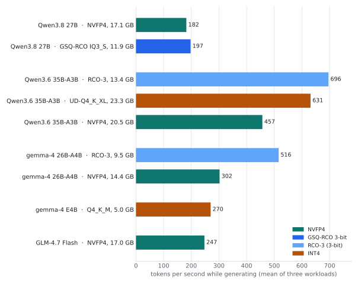
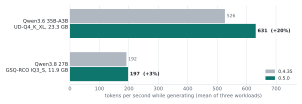
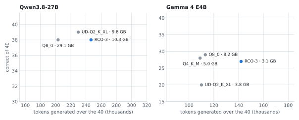

# llmash

[](https://github.com/omgitsbase/llmash/releases/latest)
[](https://github.com/omgitsbase/llmash/blob/main/LICENSE)
[](https://github.com/omgitsbase/llmash/releases/latest)
[](https://github.com/omgitsbase/llmash/releases/latest)
[](https://isocpp.org)
[](https://developer.nvidia.com/cuda-toolkit)
[](https://deepwiki.com/omgitsbase/llmash)
[](https://discord.com/users/1278248728574038041)

An Ollama-compatible server and command line for Windows and Linux, built on a
fork of llama.cpp. It keeps Ollama's commands, API and model store, so anything
already pointed at Ollama keeps working. What it changes is how each model runs:
the runtime, the launch settings, the drafter, and, when a repository has no
build at the size you want, the build itself.

## Contents

- [Install](#install)
- [Performance](#performance)
- [Weight formats](#weight-formats)
- [The runtime](#the-runtime)
- [Models and pulling](#models-and-pulling)
- [Context](#context)
- [Custom builds](#custom-builds)
- [Speculation](#speculation)
- [Commands](#commands)
- [Configuration](#configuration)
- [Building](#building)

## Install

Windows, in a user-level PowerShell:

```powershell
irm https://raw.githubusercontent.com/omgitsbase/llmash/main/install.ps1 | iex
```

Linux:

```sh
curl -fsSL https://raw.githubusercontent.com/omgitsbase/llmash/main/install.sh | sh
```

Already installed: `llmash update`.

The installer puts `llmash` on your PATH, fetches the runtime for your hardware
and starts the server: in the tray on Windows, as a systemd service on Linux.
An NVIDIA card from Turing (RTX 20) on, with driver 580 or newer, gets llmash's
own CUDA 13 runtime on both systems. Anything else gets upstream llama.cpp's
Vulkan or CPU build, and models load into system RAM, which works but is slower.

| | Windows | Linux |
|---|---|---|
| Runtime | llmash CUDA 13, else Vulkan or CPU | llmash CUDA 13, else Vulkan or CPU |
| Runs as | tray app, starts at login | systemd service (`--no-service` to skip) |
| Installs to | `%ProgramData%\llmash` | `/usr/local/lib/llmash`, or `~/.local` with `--user` |
| Options | `-NoOllama`, `-Runtime`, `-Dir`, `-Yes` | `--no-ollama`, `--runtime`, `--user`, `--uninstall` |

Over SSH or from a script on Windows, save the installer and pass the options up
front; with none it only lists them:

```powershell
irm https://raw.githubusercontent.com/omgitsbase/llmash/main/install.ps1 -OutFile install.ps1
powershell -ExecutionPolicy RemoteSigned -File .\install.ps1 -NoOllama
```

## Performance

All numbers are from one RTX PRO 6000 Blackwell (96 GB) on Linux, with the
runtime each release ships. Each model runs with the drafter llmash gives it: its
own MTP head (or MTP sidecar) when it has one, otherwise n-gram lookup. The
workloads and prompts are `bench/bench.py`'s: conversation, coding and thinking,
three prompts each, greedy, 600 tokens.

### Speed by weight format

<picture>
  <source media="(prefers-color-scheme: dark)" srcset="docs/formats-dark.svg">
  
</picture>

<!-- FORMATS -->

| model | build | conversation | coding | thinking |
|---|---|--:|--:|--:|
| Qwen3.8 27B | NVFP4, 17.1 GB | 169 | 174 | 204 |
| Qwen3.8 27B | GSQ-RCO IQ3_S, 11.9 GB | 193 | 188 | 211 |
| Qwen3.6 35B-A3B | RCO-3, 13.4 GB | 604 | 750 | 735 |
| Qwen3.6 35B-A3B | UD-Q4_K_XL, 23.3 GB | 583 | 627 | 683 |
| Qwen3.6 35B-A3B | NVFP4, 20.5 GB | 413 | 443 | 514 |
| gemma-4 26B-A4B | RCO-3, 9.5 GB | 436 | 547 | 564 |
| gemma-4 26B-A4B | NVFP4, 14.4 GB | 302 | 307 | 297 |
| gemma-4 E4B | Q4_K_M, 5.0 GB | 270 | 270 | 271 |
| GLM-4.7 Flash | NVFP4, 17.0 GB | 280 | 232 | 231 |

<!-- /FORMATS -->

Tokens per second while generating, median of the three prompts, excluding model
load and prompt processing. Speculative decoding runs faster on predictable
text, so coding and thinking usually read higher than conversation, and a model
with an MTP head drafts better than one on n-gram lookup.

### 0.4.35 against 0.5.0

<picture>
  <source media="(prefers-color-scheme: dark)" srcset="docs/release-dark.svg">
  
</picture>

The same files and flags on the runtime 0.4.35 shipped and on this one. The
output is the same text; the difference is the runtime's kernels and the draft
head, described under [The runtime](#the-runtime).

### What a 3-bit build costs in accuracy

<picture>
  <source media="(prefers-color-scheme: dark)" srcset="docs/math-dark.svg">
  
</picture>

Forty math questions (ten each from GSM8K, MATH level 3, MATH level 5 and AIME
2025), thinking on, Qwen's recommended sampling with a fixed seed per question,
graded by the final `\boxed{}` answer. On Qwen3.8-27B the RCO-3 build answered
as many as Q8_0 at a third of the size. On Qwen3-1.7B it lost ten of 28: a small
model has little redundancy, and 3 bits costs it real accuracy, as it does every
3-bit and 2-bit build there. Forty questions is a sample, not a benchmark.

## Weight formats

`pull` lists the builds a repository holds, with a few picked out:

| Row | What it is | When it is offered |
|---|---|---|
| `rco` | a published GSQ-RCO build: learned 3-bit grids, one type per tensor | the hub has one for the model |
| `custom` | an RCO build assembled here: 3 bits, one type per tensor | always, for a model with no published one |
| `medium` | NVFP4 on an all-Blackwell machine; otherwise Q4_K_M or the nearest 4-bit build | always |
| `large` | Q8_0, or the nearest 6-8 bit build | always |

NVFP4 stores weights as 4-bit floats with an FP8 scale per 16 values. Blackwell
cards (RTX 50, RTX PRO 6000, B200) run it on their FP4 tensor cores, and at the
size of a 4-bit build it keeps close to FP8 quality, so on a machine where every
card is Blackwell an NVFP4 build replaces Q4_K_M as the medium row. On older
cards it is decoded in software and a Q4_K_M runs faster. `LLMASH_FP4=1` or `0`
overrides the detection. On an all-Blackwell machine, a repository holding an
NVFP4 build next to the others reads like this:

```
qwen3.6-35b-a3b, which build?
  rco      GSQ-RCO IQ3_S             12.0 GB
> medium   NVFP4, FP8 quality        20.5 GB
  large    Q8_0                      36.9 GB
  ↑↓ move   enter choose   a all builds
```

## The runtime

The runtime is a llama.cpp fork the installer fetches beside the program. A
release that carries a newer one refreshes it; 0.5.0 carries build 143. What it
adds:

- **One CUDA graph per speculative round**: the verify batch, the accept decision
  and every draft step, with the accept decided on the GPU.
- **A 4-bit draft head**: an MTP head drafts through the 131,072 most frequent rows
  of the LM head, requantized to Q4_K at load. It reads as many bytes as the
  earlier 65,536-row Q8_0 copy and covers twice the vocabulary. Verification
  still reads the full head, so the output is the model's own.
- **Fused recurrent layers**: on delta-net layers (Qwen3.5, 3.6, 3.8 and the
  Next models) the input projection runs the causal convolution, its SiLU and the
  state snapshots in its own store, the gating projections run as one launch, the
  recurrence normalizes q and k as it loads them, and the gated norm is quantized
  straight into the output projection's input.
- **Fused mixture-of-experts tails**: the expert matvec applies the router
  weights as it stores, and a residual add rides the output projection it follows.
- **Every fusion is matched on the graph, not by model name**, so any architecture
  with the pattern gets it, and each has a bit in `GGML_CUDA_FUSE_OFF` to turn it
  off. Qwen3.6-35B-A3B's verify round launches at least a quarter fewer kernels
  than without them.

Each release's runtime is checked for the same greedy text as the one before it.
This one matches 0.4.35's on Qwen3.6-35B-A3B UD-Q4_K_XL and Qwen3.8-27B GSQ-RCO
with MTP. Each fusion was checked the same way against the build before it on
Qwen3.8-27B NVFP4 and RCO-3, Qwen3.6-35B-A3B RCO-3, Qwen3-1.7B, Gemma 4 26B-A4B
and E4B, and GLM-4.7-Flash, and the text is the same on 1, 2 and 3 GPUs under
layer split.

## Models and pulling

Ollama's store is found and used as it is. A folder of GGUFs from llama.cpp or
LM Studio is one command away:

```powershell
llmash models set D:\models
```

It reads that folder in place, subfolders included. Nothing is copied or
deleted, and `rm` will not touch it. `llmash models` shows what is being read.
This is the same setting as `OLLAMA_MODELS`.

`pull` takes an Ollama name or a Hugging Face repository as `hf.co/<org>/<repo>`,
lists its builds and asks which; `hf.co/<org>/<repo>@<quant>` or `--quant` names
one directly. A width asked for by name is a requirement: when the repository
does not have it, the pull stops and lists what it does have. A repository with
no GGUF is answered only by a GGUF conversion of that exact model, never a
fine-tune, merge or abliteration of it; when there is none, the pull says so and
lists the near matches as different models. Files come down over several
connections at once, inside the server, so closing the terminal does not stop it.

`rm` takes a model's full name or any part of it: `llmash rm qwen` removes the
one model with qwen in its name, and when several match it lists them and
removes none.

## Context

A model runs at 8192 tokens unless something asks for more: the request's
`num_ctx`, `llmash ctx`, or the `num_ctx` in an Ollama model's Modelfile. Past its
trained context, llmash runs it under YaRN, up to four times the trained length.

```
llmash ctx qwen3.8-27b:rco-3 768k --keep
qwen3.8-27b:rco-3 runs at 768k (YaRN x3 over the trained 256k); 59 GB on the card at f16, 92 free
loading and keeping it ... loaded
```

`--kv q8_0` halves the cache and `--keep` holds the model loaded. The cost comes
from the model's header: how many layers attend over the whole context, how many
heads they keep, and what a recurrent or windowed layer holds instead. On Windows
every video allocation is backed by commit charge (RAM plus pagefile), so llmash
reads that figure live and `ctx` says when a window is over it rather than over
the card.

## Custom builds

`pull` lists a build assembled here beside the published ones. Every tensor is
measured at each candidate type and given the one that buys the most accuracy per
byte under a size budget. The measure is imatrix-weighted weight error, the
budget is met by bisection on one Lagrange multiplier, and only the output head
and the embedding keep a floor. The ladder runs 2.4, 2.75 and 3 bits a weight.

This is the allocation idea from the published GSQ-RCO method, run with ggml's own
quantizers. llmash does not implement GSQ's learned grids, and none of GSQ-RCO's
published scores are numbers for the files llmash makes; where the hub carries a
real GSQ-RCO build, `pull` lists it first as `rco`.

The source is the smallest published build still comfortably wider than the
target, read a block at a time and quantized on the GPU, so only the result
touches disk. Qwen3.6-35B-A3B goes from 32 GB to 13 GB in 12 minutes, 10 of them
the download. `rco convert` does the same from a model already on disk.

## Speculation

A model carrying an MTP head drafts for itself, with nothing to fetch. For a model
with no head, `run` offers to look for a drafter on Hugging Face (`pulldraft` does
the same), checked against the weights before anything downloads, and a DFlash
drafter beside a model is used for it. Anything else drafts by n-gram lookup,
which speeds up text the conversation already holds.

## Commands

| | |
|---|---|
| `list` `ps` `show` `run` `pull` `cp` `stop` | as in Ollama |
| `rm`, `remove` | remove a model by its name or any part of it |
| `start` | start llmash in the background, with its tray icon (Windows) |
| `serve` | run the server in this console; `--host`, `--port`, `--ctx`, `--kv`, `--gpu-budget`, `--verbose` |
| `ctx` | the context a model runs at, up to 4x its trained length under YaRN; `--kv`, `--keep`, `--release` |
| `pulldraft` | find and install a draft model for a model you have |
| `rco convert` | assemble a custom build from a model already on disk |
| `models` | show where models are read from, or point llmash at a folder of them |
| `doctor` | check the install, runtime, GPU, models and routes |
| `update` | install the latest release when it is newer; `--force` to reinstall |
| `launch` | point Claude Code, Codex, Droid and others at this server |
| `link` | expose the API over a Tailscale funnel, with a key |
| `uninstall` | remove everything the installer created |

`ollama` is installed as an alias.

## Configuration

Optional. `local.json` next to the program, or environment variables; the
variable wins over the file.

| | |
|---|---|
| `OLLAMA_MODELS`, `LLMASH_MODELS` | the models directory: a store, or a folder of GGUFs read in place |
| `LLMASH_PORT` | local API port (default 11434) |
| `LLMASH_CTX` | default context length (default 8192) |
| `LLMASH_KV` | K/V cache type, `f16` or `q8_0` |
| `LLMASH_YARN_MAX` | how far past its trained context a model may run under YaRN (default 4) |
| `LLMASH_GPU_BUDGET_GB` | what one process may hold on the card, instead of what commit charge allows |
| `LLMASH_VRAM_HEADROOM` | what to leave free on the cards when fitting (default 8% of them, 1 to 6 GB) |
| `LLMASH_PARALLEL` | server slots (default 1) |
| `LLMASH_PIN` | comma-separated models never evicted |
| `LLMASH_FP4` | `1` or `0`: whether every card runs FP4, instead of asking nvidia-smi |
| `LLMASH_SPEC_FALLBACK` | drafter for models without one (default `ngram-mod`) |
| `LLMASH_MTP_DRAFT` | tokens an MTP head drafts per round (default 3) |
| `LLMASH_PREFER_DFLASH` | draft with a DFlash drafter beside the model even when it has an MTP head |
| `LLMASH_TUNE_OFF` | disable individual tuning: `cache-reuse,cache-ram,batch,prio` |
| `LLMASH_RCO_THREADS` | cores a custom build may quantize on (default: all but one) |

`local.json` takes the same things by name, plus a few per model: `ctx_override`
and `ctx_max`, `fit` for a model's cache type, `pin`, `launch_extra` for extra
`llama-server` flags by name fragment, `no_mmproj`, `runtime` for another
`llama-server`, `extra_roots` for further folders to read, and `gguf_dir` for
where pulled GGUFs go. `llmash serve --help` lists the rest.

## Building

Windows: Visual Studio 2022 with the C++ workload; CMake comes with it.

```powershell
python build.py           # dist/llmash-win-x64.zip, and the Linux tarball when Docker is there
python build.py --here    # ...and run this checkout on it
```

Linux: `cpp/build-linux.sh` in the container from `cpp/Dockerfile.test`, and
`cpp/run-tests.sh` for the tests. `python bench/bench.py --help` reproduces the
speed numbers and `python bench/charts.py` redraws the charts.

## License

MIT.
