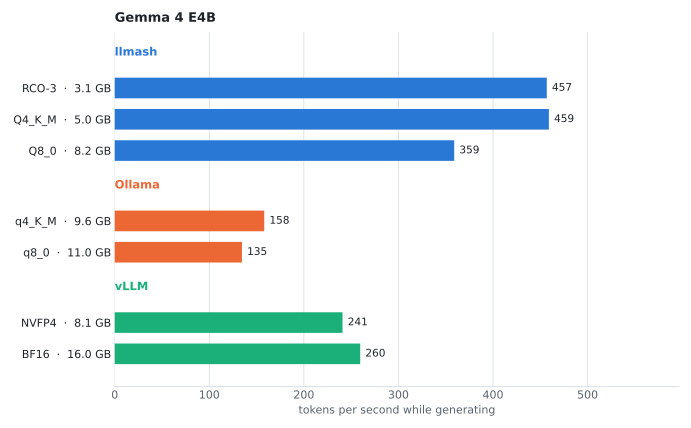
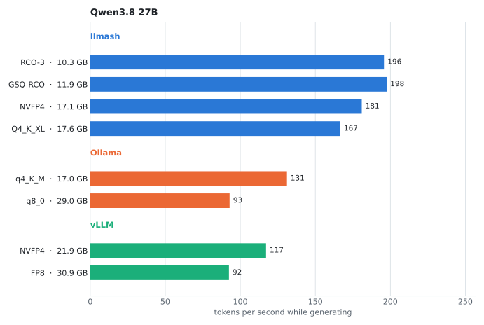
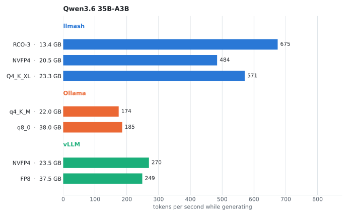
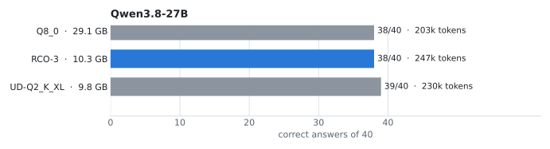
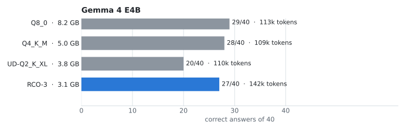

# llmash

[](https://github.com/omgitsbase/llmash/releases/latest)
[](https://github.com/omgitsbase/llmash/blob/main/LICENSE)
[](https://github.com/omgitsbase/llmash/releases/latest)
[](https://github.com/omgitsbase/llmash/releases/latest)
[](https://isocpp.org)
[](https://developer.nvidia.com/cuda-toolkit)
[](https://deepwiki.com/omgitsbase/llmash)
[](https://discord.com/users/1274629090346926121)

An Ollama-compatible server and command line for Windows and Linux, built on a
fork of llama.cpp. It keeps Ollama's commands, API and model store, so anything
already pointed at Ollama keeps working. What it changes is how each model runs:
the runtime, the launch settings, the drafter, and, when a repository has no
build at the size you want, the build itself.

## Contents

- [Install](#install)
- [Performance](#performance)
- [Weight formats](#weight-formats)
- [The runtime](#the-runtime)
- [Models and pulling](#models-and-pulling)
- [Classifiers](#classifiers)
- [Context](#context)
- [Custom builds](#custom-builds)
- [Speculation](#speculation)
- [Commands](#commands)
- [Configuration](#configuration)
- [Building](#building)

## Install

Windows, in a user-level PowerShell:

```powershell
irm https://raw.githubusercontent.com/omgitsbase/llmash/main/install.ps1 | iex
```

Linux:

```sh
curl -fsSL https://raw.githubusercontent.com/omgitsbase/llmash/main/install.sh | sh
```

Already installed: `llmash update`.

The installer puts `llmash` on your PATH, fetches the runtime for your hardware
and starts the server: in the tray on Windows, as a systemd service on Linux.
An NVIDIA card from Turing (RTX 20) on, with driver 580 or newer, gets llmash's
own CUDA 13 runtime on both systems. Anything else gets upstream llama.cpp's
Vulkan or CPU build, and models load into system RAM, which works but is slower.

| | Windows | Linux |
|---|---|---|
| Runtime | llmash CUDA 13, else Vulkan or CPU | llmash CUDA 13, else Vulkan or CPU |
| Runs as | tray app, starts at login | systemd service (`--no-service` to skip) |
| Installs to | `%ProgramData%\llmash` | `/usr/local/lib/llmash`, or `~/.local` with `--user` |
| Options | `-NoOllama`, `-Runtime`, `-Dir`, `-Yes` | `--no-ollama`, `--runtime`, `--user`, `--uninstall` |

Over SSH or from a script on Windows, save the installer and pass the options up
front; with none it only lists them:

```powershell
irm https://raw.githubusercontent.com/omgitsbase/llmash/main/install.ps1 -OutFile install.ps1
powershell -ExecutionPolicy RemoteSigned -File .\install.ps1 -NoOllama
```

## Performance

All numbers are from one RTX PRO 6000 Blackwell (96 GB) under Linux. Every
provider gets the same requests: `bench/bench.py`'s conversation, coding and
thinking workloads, three prompts each, greedy, 600 tokens, streamed. Speed is
counted from the first streamed token to the last, so model load and prompt
processing are left out.

### Against Ollama and vLLM

One bar per build, grouped by provider, the size on disk in the label. Each runs
the way its provider runs it: llmash with the drafter it pairs with the model
(the model's own MTP head, or Gemma's assistant drafter), vLLM with MTP or the
same assistant drafter at three tokens a round, and Ollama as it ships. A bar is
the mean of the three workloads; the table under it has each.

<!-- PROVIDERS -->

#### Gemma 4 E4B

<picture>
  <source media="(prefers-color-scheme: dark)" srcset="docs/speed-gemma-4-e4b-dark.svg">
  
</picture>

| provider | build | size | conversation | coding | thinking |
|---|---|--:|--:|--:|--:|
| llmash | RCO-3 | 3.1 GB | 324 | 478 | 569 |
| llmash | Q4_K_M | 5.0 GB | 321 | 513 | 543 |
| llmash | Q8_0 | 8.2 GB | 245 | 398 | 434 |
| Ollama | q4_K_M | 9.6 GB | 151 | 160 | 163 |
| Ollama | q8_0 | 11.0 GB | 133 | 133 | 137 |
| vLLM | NVFP4 | 8.1 GB | 191 | 251 | 281 |
| vLLM | BF16 | 16.0 GB | 187 | 283 | 308 |

#### Qwen3.8 27B

<picture>
  <source media="(prefers-color-scheme: dark)" srcset="docs/speed-qwen3-8-27b-dark.svg">
  
</picture>

| provider | build | size | conversation | coding | thinking |
|---|---|--:|--:|--:|--:|
| llmash | RCO-3 | 10.3 GB | 183 | 192 | 213 |
| llmash | GSQ-RCO | 11.9 GB | 193 | 189 | 211 |
| llmash | NVFP4 | 17.1 GB | 168 | 172 | 203 |
| llmash | Q4_K_XL | 17.6 GB | 162 | 165 | 173 |
| Ollama | q4_K_M | 17.0 GB | 110 | 136 | 148 |
| Ollama | q8_0 | 29.0 GB | 76 | 100 | 104 |
| vLLM | NVFP4 | 21.9 GB | 111 | 115 | 125 |
| vLLM | FP8 | 30.9 GB | 88 | 94 | 95 |

#### Qwen3.6 35B-A3B

<picture>
  <source media="(prefers-color-scheme: dark)" srcset="docs/speed-qwen3-6-35b-a3b-dark.svg">
  
</picture>

| provider | build | size | conversation | coding | thinking |
|---|---|--:|--:|--:|--:|
| llmash | RCO-3 | 13.4 GB | 601 | 749 | 673 |
| llmash | NVFP4 | 20.5 GB | 428 | 486 | 538 |
| llmash | Q4_K_XL | 23.3 GB | 530 | 569 | 613 |
| Ollama | q4_K_M | 22.0 GB | 164 | 179 | 180 |
| Ollama | q8_0 | 38.0 GB | 176 | 188 | 192 |
| vLLM | NVFP4 | 23.5 GB | 252 | 270 | 287 |
| vLLM | FP8 | 37.5 GB | 223 | 252 | 270 |

<!-- /PROVIDERS -->

Tokens per second while generating, median of the three prompts in each
workload. Speculative decoding runs faster on predictable text, so coding and
thinking usually read higher than conversation.

### What a 3-bit build costs in accuracy

Forty math questions (ten each from GSM8K, MATH level 3, MATH level 5 and AIME
2025), thinking on, each family's recommended sampling with a fixed seed per
question, graded by the final `\boxed{}` answer. Each bar's end says how many
tokens the build generated over the forty: a build that thinks longer to get
there spends part of its speed advantage.

<!-- MATH -->

#### Qwen3.8-27B

<picture>
  <source media="(prefers-color-scheme: dark)" srcset="docs/math-qwen3-8-27b-dark.svg">
  
</picture>

| build | size | GSM8K | MATH L3 | MATH L5 | AIME 2025 | total | tokens |
|---|--:|--:|--:|--:|--:|--:|--:|
| Q8_0 | 29.1 GB | 9/10 | 10/10 | 10/10 | 9/10 | 38/40 | 203k |
| RCO-3 | 10.3 GB | 9/10 | 10/10 | 10/10 | 9/10 | 38/40 | 247k |
| UD-Q2_K_XL | 9.8 GB | 9/10 | 10/10 | 10/10 | 10/10 | 39/40 | 230k |

#### Gemma 4 E4B

<picture>
  <source media="(prefers-color-scheme: dark)" srcset="docs/math-gemma-4-e4b-dark.svg">
  
</picture>

| build | size | GSM8K | MATH L3 | MATH L5 | AIME 2025 | total | tokens |
|---|--:|--:|--:|--:|--:|--:|--:|
| Q8_0 | 8.2 GB | 8/10 | 9/10 | 10/10 | 2/10 | 29/40 | 113k |
| Q4_K_M | 5.0 GB | 9/10 | 9/10 | 9/10 | 1/10 | 28/40 | 109k |
| UD-Q2_K_XL | 3.8 GB | 7/10 | 6/10 | 6/10 | 1/10 | 20/40 | 110k |
| RCO-3 | 3.1 GB | 7/10 | 9/10 | 10/10 | 1/10 | 27/40 | 142k |

<!-- /MATH -->

On Qwen3.8-27B the RCO-3 build answered as many as Q8_0, 38 of 40, at a third
of the size. On Gemma 4 E4B it answered 27 to Q8_0's 29 at 38% of the size,
where a 2-bit build of about the same size answered 20. Both RCO-3 builds wrote
more to get there: 21% more tokens than Q8_0 on Qwen3.8-27B and 25% more on
Gemma 4 E4B, which spends part of a 3-bit build's speed on longer reasoning.
Forty questions is a sample, not a benchmark.

## Weight formats

`pull` lists the builds a repository holds, with a few picked out:

| Row | What it is | When it is offered |
|---|---|---|
| `rco` | a published GSQ-RCO build: learned 3-bit grids, one type per tensor | the hub has one for the model |
| `custom` | an RCO build assembled here: 3 bits, one type per tensor | always, for a model with no published one |
| `medium` | NVFP4 when every card is sm_120 (0.5.0 and up), from another repository of the same model when this one has none (0.5.1 and up); otherwise Q4_K_M or the nearest 4-bit build | always |
| `large` | Q8_0, or the nearest 6-8 bit build | always |

NVFP4 stores weights as 4-bit floats with an FP8 scale per 16 values, which
keeps close to FP8 quality at the size of a 4-bit build. Cards of compute capability 12.0
(sm_120: the RTX 50 series and the Blackwell RTX PRO cards) run it on their FP4
tensor cores; a B200 is sm_100, which this runtime's FP4 kernels are not built
for. On a dense model it is the
better 4-bit format there: Qwen3.8-27B NVFP4 generates 2-14% faster than the
UD-Q4_K_XL build of the same size and reads a long prompt 31% faster. On a
mixture-of-experts model it reads prompts at the same rate as Q4 and, depending
on what the file keeps at higher precision, can generate slower. So on a machine
where every card is sm_120, the medium row is an NVFP4 build when the
repository has one. Older cards decode it in software, and a Q4_K_M runs faster
there. `LLMASH_FP4=1` or `0` overrides the detection. On such a
machine, a repository holding an NVFP4 build next to the others reads like this:

```
qwen3.8-27b, which build?
  rco      GSQ-RCO IQ3_S             11.9 GB
> medium   NVFP4, FP8 quality        17.1 GB
  large    Q8_0                      29.1 GB
  ↑↓ move   enter choose   a all builds
```

## The runtime

The runtime is a llama.cpp fork the installer fetches beside the program, and
`llmash update` refreshes it when a release carries a newer one. What it adds:

- **One CUDA graph per speculative round**: the verify batch, the accept decision
  and every draft step, with the accept decided on the GPU.
- **A 4-bit draft head**: an MTP head drafts through the 131,072 most frequent rows
  of the LM head, requantized to Q4_K at load, for about the bytes of 65,536 rows
  at Q8_0. Verification still reads the full head, so the output is the model's
  own.
- **Fused recurrent layers**: on delta-net layers (Qwen3.5, 3.6, 3.8 and the
  Next models) the input projection runs the causal convolution, its SiLU and the
  state snapshots in its own store, the gating projections run as one launch, the
  recurrence normalizes q and k as it loads them, and the gated norm is quantized
  straight into the output projection's input.
- **Fused mixture-of-experts tails**: the expert matvec applies the router
  weights as it stores, and a residual add rides the output projection it follows.
- **NVFP4 under speculation**: the second-level scales of NVFP4 weights, per
  expert or per tensor, ride the matvecs of a verify batch as they do for a single
  token, so the expert gate and up still fuse, and a float gate and up pair (the
  BF16 shared experts NVFP4 files often keep) runs as one launch.
- **Every fusion is matched on the graph, not by model name**, so any architecture
  with the pattern gets it, and each has a bit in `GGML_CUDA_FUSE_OFF` to turn it
  off.

Each release's runtime is checked for the same greedy text as the one before it,
on dense, mixture-of-experts and delta-net models, across NVFP4, 3-bit and 4-bit
builds, with MTP and n-gram drafting, and on 1, 2 and 3 GPUs under layer split.

## Models and pulling

Ollama's store is found and used as it is. A folder of GGUFs from llama.cpp or
LM Studio is one command away:

```powershell
llmash models set D:\models
```

It reads that folder in place, subfolders included. Nothing is copied or
deleted, and `rm` will not touch it. `llmash models` shows what is being read.
This is the same setting as `OLLAMA_MODELS`.

`pull` takes an Ollama name or a Hugging Face repository as `hf.co/<org>/<repo>`,
lists its builds and asks which; `hf.co/<org>/<repo>@<quant>` or `--quant` names
one directly. A width asked for by name is a requirement: when the repository
does not have it, the pull stops and lists what it does have. A repository with
no GGUF is answered only by a GGUF conversion of that exact model, never a
fine-tune, merge or abliteration of it; when there is none, the pull says so and
lists the near matches as different models. Files come down over several
connections at once, inside the server, so closing the terminal does not stop it.
A gated repository (Gemma and Llama as their makers publish them) is read with
the token `hf auth login` stores, or `HF_TOKEN`; the token goes to the hub only.
A build named without a width (`-APEX-Balanced`, `gemma-2b.gguf`) is listed by
what sets it apart and taken by that name.

`rm` takes a model's full name or any part of it (0.5.0 and up): `llmash rm qwen`
removes the one model with qwen in its name, and when several match it lists
them and removes none.

## Classifiers

A classifier answers questions about a text from one forward pass and generates
nothing (0.5.2 and up). The hub tags them `text-classification`: decision models
such as Laya, Jev-Style and decider, and rerankers with a scoring head. `pull`
records the tag and takes whatever the repository publishes for reading the
answers: Laya's decision head is fetched as a sidecar beside the encoder, a
verdict or answer-letter model gets its readout written to `<model>.classifier.json`,
and a scoring head inside the GGUF needs nothing more. A model pulled before this
gets the same the first time it is shown or run. `show` lists such a model with
the capability `classification`.

`run` on a classifier takes questions first, one per line, then judges every line
of text against them:

```
>>> Which team should handle this? [billing, technical, sales]
>>> score: How urgent is it? [not at all, slightly, very]
>>> Is the customer angry?
>>> I was charged twice for my subscription this month and nobody answers.
Which team should handle this?  billing 91%  ·  technical 6%  ·  sales 3%
score: How urgent is it?        1.7 of 0-2  ·  not at all 4%  ·  slightly 22%  ·  very 74%
Is the customer angry?          yes 83%
```

A choice lists its options in brackets and `name: description` describes one;
`score:` lists ordered levels, lowest first; a question with no options is
answered yes or no. The same lines work in any chat window pointed at llmash, put
after the text or in the system prompt, and `/api/chat`, `/api/generate` and
`/v1/chat/completions` answer with the lines above plus an `answers` object.
`POST /api/classify` (also `/v1/systemone`, the shape decision models share)
takes the questions as JSON:

```json
{"model": "laya:q8_0",
 "state": "I was charged twice for my subscription this month.",
 "questions": {"team": {"type": "choice", "instructions": "Which team should handle this?",
                        "criteria": {"billing": "payments, invoices, refunds", "technical": "bugs and outages"}},
               "urgent": {"type": "score", "instructions": "How urgent is it?",
                          "criteria": ["not at all", "slightly", "very"]},
               "angry": {"type": "noul", "instructions": "Is the customer angry?"}}}
```

and answers `{"answers": {"team": {"type": "choice", "choice": "billing", "probabilities": {...}, "confidence": 0.8}, ...}}`.
`state` may be an object. A chat model asked on `/api/classify` is read at the
answer letter of the common decision prompt, which works less well than a model
trained for it; `<model>.classifier.json` beside a GGUF says how any model is read.

## Context

A model runs at 8192 tokens unless something asks for more: the request's
`num_ctx`, `llmash ctx`, or the `num_ctx` in an Ollama model's Modelfile. Past its
trained context, llmash runs it under YaRN, up to four times the trained length.

```
llmash ctx qwen3.8-27b:rco-3 768k --keep
qwen3.8-27b:rco-3 runs at 768k (YaRN x3 over the trained 256k); 59 GB on the card at f16, 92 free
loading and keeping it ... loaded
```

`--kv q8_0` halves the cache and `--keep` holds the model loaded. The cost comes
from the model's header: how many layers attend over the whole context, how many
heads they keep, and what a recurrent or windowed layer holds instead. On Windows
every video allocation is backed by commit charge (RAM plus pagefile), so llmash
reads that figure live and `ctx` says when a window is over it rather than over
the card.

## Custom builds

`pull` lists a build assembled here beside the published ones. Every tensor is
measured at each candidate type and given the one that buys the most accuracy per
byte under a size budget. The measure is imatrix-weighted weight error, the
budget is met by bisection on one Lagrange multiplier, and only the output head
and the embedding keep a floor. The ladder runs 2.4, 2.75 and 3 bits a weight.

This is the allocation idea from the published GSQ-RCO method, run with ggml's own
quantizers. llmash does not implement GSQ's learned grids, and none of GSQ-RCO's
published scores are numbers for the files llmash makes; where the hub carries a
real GSQ-RCO build, `pull` lists it first as `rco`.

The source is the smallest published build still comfortably wider than the
target, read a block at a time and quantized on the GPU, so only the result
touches disk. Qwen3.6-35B-A3B goes from 32 GB to 13 GB in 12 minutes, 10 of them
the download. `rco convert` does the same from a model already on disk.

## Speculation

A model carrying an MTP head drafts for itself, with nothing to fetch. For a model
with no head, `run` asks once whether to look for a drafter on Hugging Face, and
`pulldraft` looks whenever asked. The search (0.5.1 and up) knows the model by its
own header, takes a drafter trained for that exact model, and offers the choice
when several fit:

- an EAGLE-3, DFlash, DSpark or plain draft model published for it;
- Gemma 4's assistant drafter, which Google publishes for each of its models;
- the MTP head out of a full build that carries one (an `-MTP` GGUF): only the
  head is fetched, as a sidecar, so a build without its head gets one back;
- for a fine-tune with nothing under its own name, the drafters of the model it
  was tuned from, said so, which share its vocabulary and draft somewhat less well.

Each is checked against the weights before anything downloads, one sidecar serves
every build of its model, and `pulldraft MODEL hf.co/ORG/REPO` names one instead
of searching. Gemma 4 E4B generates 1.2 to 2 times as fast with its assistant
drafter. Anything else drafts by n-gram lookup, which speeds up text the
conversation already holds.

## Commands

| | |
|---|---|
| `list` `ps` `show` `run` `pull` `cp` `stop` | as in Ollama |
| `rm`, `remove` | remove a model by its name or any part of it |
| `start` | start llmash in the background, with its tray icon (Windows) |
| `serve` | run the server in this console; `--host`, `--port`, `--ctx`, `--kv`, `--gpu-budget`, `--verbose` |
| `ctx` | the context a model runs at, up to 4x its trained length under YaRN; `--kv`, `--keep`, `--release` |
| `pulldraft` | find and install a draft model for a model you have; `pulldraft MODEL REPO` takes one you name |
| `rco convert` | assemble a custom build from a model already on disk |
| `models` | show where models are read from, or point llmash at a folder of them |
| `doctor` | check the install, runtime, GPU, models and routes |
| `update` | install the latest push to main (the `edge` build), or with `--stable` the latest release; `--force` to reinstall |
| `launch` | point Claude Code, Codex, Droid and others at this server |
| `link` | expose the API over a Tailscale funnel, with a key |
| `uninstall` | remove everything the installer created |

`ollama` is installed as an alias.

## Configuration

Optional. `local.json` next to the program, or environment variables; the
variable wins over the file.

| | |
|---|---|
| `OLLAMA_MODELS`, `LLMASH_MODELS` | the models directory: a store, or a folder of GGUFs read in place |
| `LLMASH_PORT` | local API port (default 11434) |
| `LLMASH_CTX` | default context length (default 8192) |
| `LLMASH_KV` | K/V cache type, `f16` or `q8_0` |
| `LLMASH_YARN_MAX` | how far past its trained context a model may run under YaRN (default 4) |
| `LLMASH_GPU_BUDGET_GB` | what one process may hold on the card, instead of what commit charge allows |
| `LLMASH_VRAM_HEADROOM` | what to leave free on the cards when fitting (default 8% of them, 1 to 6 GB) |
| `LLMASH_PARALLEL` | server slots (default 1) |
| `LLMASH_PIN` | comma-separated models never evicted |
| `LLMASH_FP4` | `1` or `0`: whether every card runs FP4, instead of asking nvidia-smi |
| `LLMASH_SPEC_FALLBACK` | drafter for models without one (default `ngram-mod`) |
| `LLMASH_MTP_DRAFT` | tokens an MTP head drafts per round (default 3) |
| `LLMASH_PREFER_DFLASH` | draft with a DFlash drafter beside the model even when it has an MTP head |
| `LLMASH_TUNE_OFF` | disable individual tuning: `cache-reuse,cache-ram,batch,prio` |
| `LLMASH_RCO_THREADS` | cores a custom build may quantize on (default: all but one) |

`local.json` takes the same things by name, plus a few per model: `ctx_override`
and `ctx_max`, `fit` for a model's cache type, `pin`, `launch_extra` for extra
`llama-server` flags by name fragment, `no_mmproj`, `runtime` for another
`llama-server`, `extra_roots` for further folders to read, and `gguf_dir` for
where pulled GGUFs go. `llmash serve --help` lists the rest.

## Building

Windows: Visual Studio 2022 with the C++ workload; CMake comes with it.

```powershell
python build.py           # dist/llmash-win-x64.zip, and the Linux tarball when Docker is there
python build.py --here    # ...and run this checkout on it
```

Linux: `cpp/build-linux.sh` in the container from `cpp/Dockerfile.test`, and
`cpp/run-tests.sh` for the tests. `python bench/bench.py --help` reproduces the
speed numbers and `python bench/charts.py` redraws the charts.

## License

MIT.
